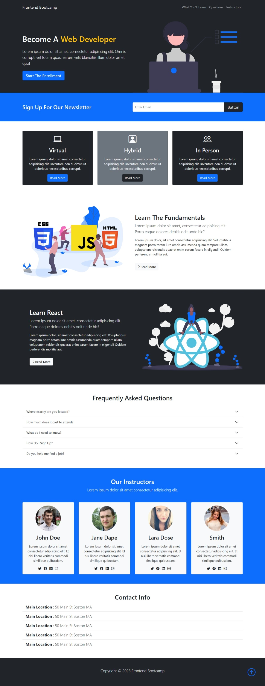

# Frontend Bootcamp - Practice Website

A clean, responsive landing page for a web development bootcamp built using **Bootstrap 5**. This project features a professional UI designed to showcase course offerings, instructors, and enrollment information.

---

## 🚀 Features

* **Responsive Navigation**: A sticky dark-themed navbar with smooth-scroll links to What You'll Learn, Questions, and Instructors.
* **Hero Showcase**: An engaging header section with a call-to-action button that triggers an enrollment modal.
* **Newsletter Integration**: A stylized subscription bar for email lead generation.
* **Learning Paths**: 
    * **Modular Learning**: Three cards highlighting Virtual, Hybrid, and In-Person learning options.
    * **Course Content**: Detailed sections for learning Web Fundamentals and React.
* **FAQ Section**: A functional Bootstrap Accordion for frequently asked questions.
* **Instructor Profiles**: A grid layout displaying instructor cards with social media links and profile images.
* **Enrollment System**: A functional Modal form for capturing student lead information.
* **Contact Info**: A clear section for physical location details.

## 🛠️ Technology Stack

* **HTML5**: Semantic web structure.
* **Bootstrap 5**: Utilized for responsive layout, grids, and UI components like Modals and Accordions.
* **Bootstrap Icons**: Used for professional iconography throughout the site.
* **Custom CSS**: Linked via `style.css` for personalized styling.

## 📁 Project Structure

* **index.html**: The main landing page containing all sections and UI components.
* **style.css**: Custom style definitions for the project.
* **img/**: Directory containing SVG illustrations for the showcase and course sections.

---

## 👤 Author

* 👤 **Name**: MH Nahid

## 🌐 Social Media

* 📧 **Contact**: [Send an Email](mailto:mokbulhasannahid@gmail.com)